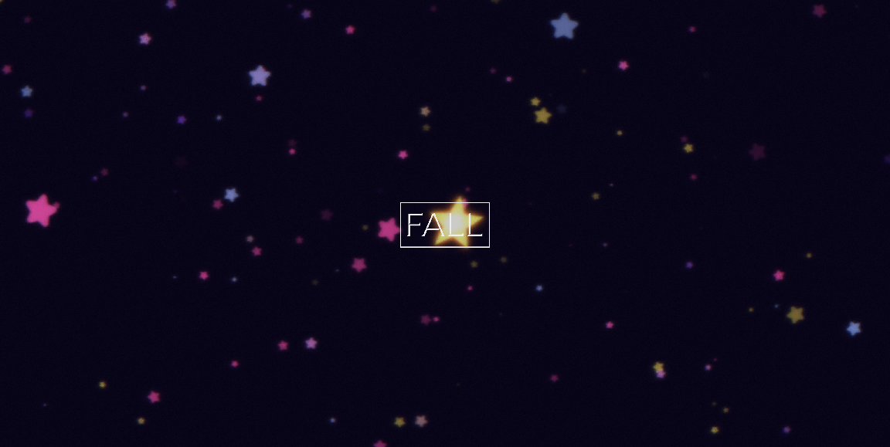

# fall
Watch a star fall.

# Demo
A slightly outdated version is available at https://development.d3e91ion2xbpxn.amplifyapp.com/

For an up-to-date demo, run this project locally.

# Dependencies
* [react](https://reactjs.org/)
* [styled-components](https://styled-components.com/)
* [zustand](https://github.com/pmndrs/zustand)
* [babylon.js](https://www.babylonjs.com/)
* [magenta.js](https://github.com/magenta/magenta-js)
* [soundfont-player](https://github.com/danigb/soundfont-player)

## Run locally
You need to have Git and NodeJS to run the following commands:

    git clone https://github.com/Mr-Quin/fall.git
    npm i
    npm run start
